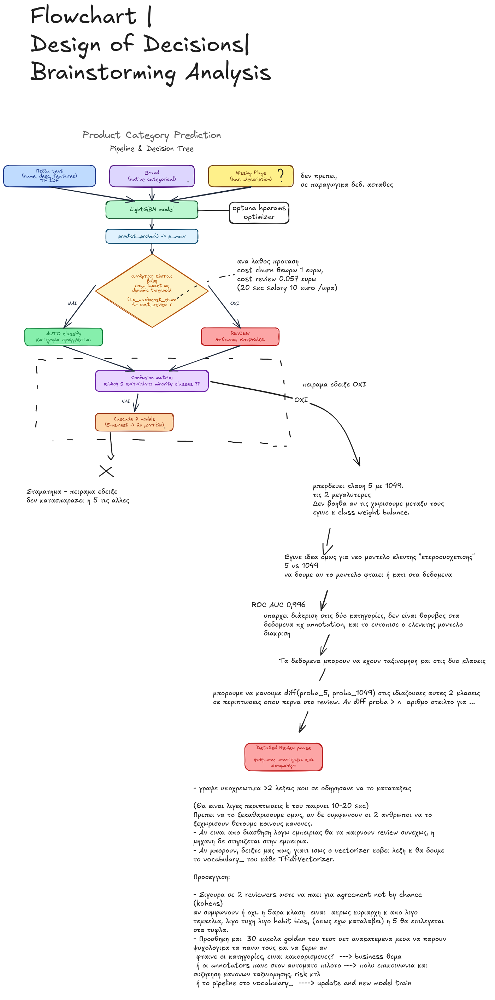
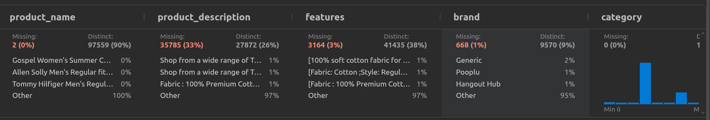
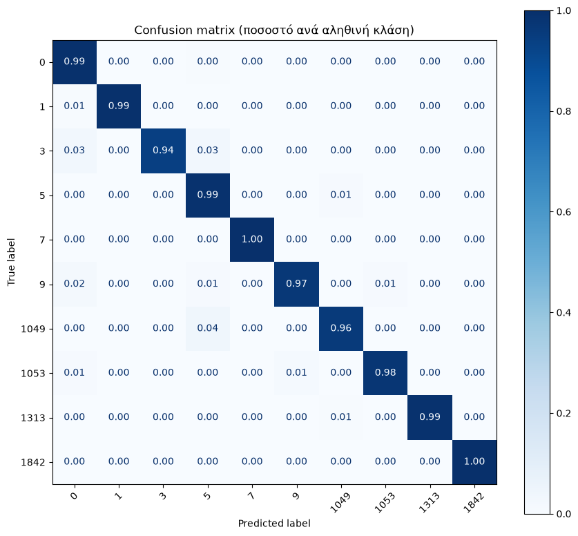
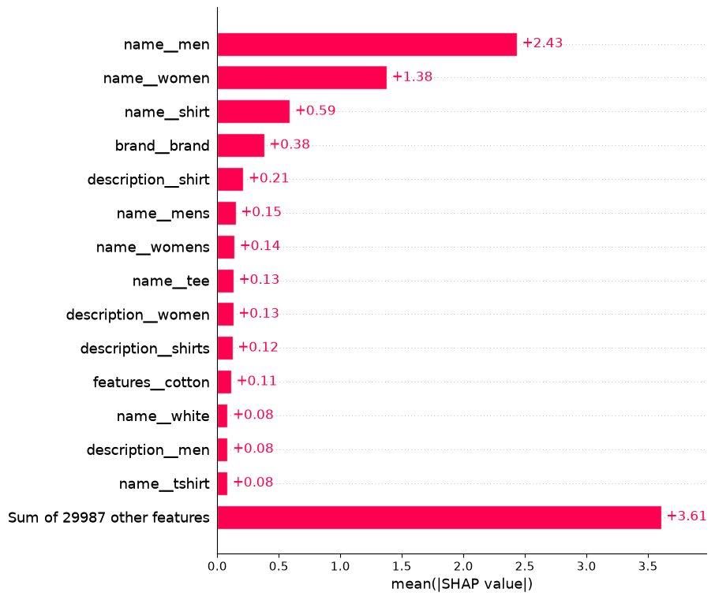

# Product Category Prediction — Αναλυτική Έκθεση

**Δεδομένα:** 107.841 προϊόντα, 10 κατηγορίες, 4 πεδία κειμένου
**Pipeline:** TF-IDF ανά πεδίο, μετά LightGBM, μετά Platt calibration, μετά cost-based κανόνας AUTO ή REVIEW
**Artifact:** `model_storage/calibrated_model.joblib`, δέχεται raw DataFrame

| Αποτέλεσμα | Τιμή |
|---|---|
| macro F1 | 0,9842 |
| MCC | 0,9709 |
| accuracy | 0,9849 |


Με AUTO εννοούμε αυτόματη ταξινόμηση, δηλαδή η κατηγορία εφαρμόζεται χωρίς
να τη δει άνθρωπος. Με REVIEW εννοούμε ότι το προϊόν πηγαίνει σε ανθρώπινο
έλεγχο.

**Ιδέα: Πόσα πάνε αυτόματα δεν είναι ιδιότητα του μοντέλου μονο, είναι και επιλογή βαση συναρτησης κόστους.**
Το μοντέλο παράγει βαθμονομημένες πιθανότητες το πού μπαίνει το threshold το
ορίζω συναρτη κοστους ευαισθησιας, η σχέση ανάμεσα στο κόστος ενός λάθους (churn error per customer) και στο κόστος ενός ελέγχου(cost review). 


---

## Το πρόβλημα

Οι λάθος κατηγορίες σπάνε την αναζήτηση και την ανακάλυψη προϊόντων. Ένα λάθος που γίνεται με σιγουριά είναι χειρότερο από καμία απάντηση, γιατί δεν το πιάνει κανείς.

Άρα δύο στόχοι, όχι ένας: να ταξινομεί σωστά, και να ξέρει πότε να μην εμπιστεύεται την ταξινόμησή του.

---

## Ο αρχικός σχεδιασμός



Το διάγραμμα οπτικα αποτυπώνει από το brainstorming, πριν
από τις μετρήσεις πειραματων και μετα, πως επηρρεαστηκε ο σχεδιασμος καθως και μελλοντικες σκεψεις.

Τρεις από τις επιλογές του απορρίφθηκαν αργότερα με πείραμα:
το ενωμένο text field, το flag `has_description`, και το cascade δύο μοντέλων σε σειρα.
Ό,τι ακολουθεί παρακάτω υπερισχύει του διαγράμματος.

- Το `has_description` απορρίφθηκε  αν σε παραγωγη
κάποια μέρα σταματήσει να έρχεται το πεδίο από τη βάση, η σημαία γίνεται
σταθερή για όλα τα προϊόντα και το μοντέλο χάνει, χωρίς να
σκάσει τίποτα. 
- Το cascade απορρίφθηκε επειδή δεν είχε τίποτα να προσφέρει: το
πρόβλημα δεν ήταν ιεραρχικό, ήταν επικαλυπτόμενες ετικέτες ανάμεσα στην 5 και
στην 1049, και ένα δεύτερο μοντέλο σε σειρά δεν λύνει ασάφεια των δεδομένων αλλα προσθετει και πολλαπλασιαστικα σφαλμα.

- Το ενωμένο text field απορρίφθηκε για να μη πνίγει η product_name, εμπειρικα ξεκινησαμε με αυτη την αποφαση.Αποδειχθηκε κ ειδαμε οτι το gain συμφωνει, αφου τα χαρακτηριστικα φερουν εκαστος δική τους αυτοτελή αξια.
---

## Τι φτιάχτηκε

**Προετοιμασία δεδομένων**




Σβήστηκαν 6.637 πλήρη αντίγραφα, μένουν 101.204 γραμμές.

Υπάρχει σοβαρό ρίσκο leakage: 7.961 ζεύγη κειμένου επαναλαμβάνονται ως παραλλαγές μεγέθους, το μεγαλύτερο 479 φορές. Τυχαίο split βάζει το ίδιο κείμενο σε train και σε test, οπότε μετράει απομνημόνευση αντί για γενίκευση. Λύση: group split ανά `(description, features)`, επαληθευμένο με μηδέν κοινές ομάδες κειμένου.

| Σύνολο | Γραμμές | Ποσοστό | Χρήση |
|---|---|---|---|
| train | 69.664 | **69%** | εκπαίδευση |
| calibration | 11.614 | **11%** | calibration πιθανοτήτων, δεν το βλέπει το μοντέλο στο fit |
| test | 19.926 | **20%** | τελική αξιολόγηση |

Για το πείραμα του tuning παρακάτω κόπηκε και τέταρτο σύνολο: 65% train,
20% test, 7,5% validation, 7,5% calibration, ώστε οι υπερπαράμετροι να μην
επιλεγούν ποτέ κοιτώντας το test.

**Feature engineering**

Τρία ξεχωριστά TF-IDF blocks, όχι ένα ενωμένο πεδίο. Η περιγραφή έχει περίπου 50 λέξεις και το όνομα 12, οπότε ενωμένα το μακρύ πνίγει το σύντομο. Μετρήθηκε με ablation: η ένωση κοστίζει 0,0095 macro F1 έναντι μόλις 0,0008 accuracy, άρα η ζημιά είναι εξ ολοκλήρου στις μικρές κατηγορίες.

Το `features` μένει ενιαίο κείμενο, γιατί το `;` δεν είναι αξιόπιστος διαχωριστής: το 18% των bullets ξεκινά με πεζό, δηλαδή είναι κόμματα μέσα σε προτάσεις. Κανένα καθάρισμα κειμένου δεν χρειάζεται, ο `TfidfVectorizer` πετάει ήδη μόνος του τα `[`, `]`, `;`.

Το `brand` μπαίνει ως native categorical με `OrdinalEncoder(min_frequency=20)`. Υπάρχουν 9.570 brands, τα μισά με ένα μόνο προϊόν, οπότε το one-hot θα πρόσθετε χιλιάδες στήλες θορύβου.

**Μοντέλο**

`LGBMClassifier(class_weight="balanced", n_estimators=200, learning_rate=0.05, num_leaves=63, min_child_samples=15, subsample=0.75, reg_lambda=0.1, max_bin=60)`, 238 δευτερόλεπτα εκπαίδευση.

Επιλέχθηκε για τον native χειρισμό categorical, missing values (vs catboost), το retraining σε CPU, και την interpretability σε επίπεδο split.Επισης ειναι ταχυτερο στην εκπαιδευση ~50%+, slim memory, κ ευκολοτερο στο maintenance εναντι bert, stacked rnn)

Η εξισορρόπηση των κλάσεων γίνεται με το `class_weight="balanced"` της sklearn
και όχι με το `is_unbalance=True` του LightGBM, που αγνοείται σιωπηλά στο
multiclass και δουλεύει μόνο σε δυαδικά προβλήματα.  

**Calibration**

Για safeguard βάζουμε threshold στο `p_max`, άρα αυτό πρέπει να είναι πραγματική πιθανότητα και όχι σκορ κατάταξης.

Το isotonic δοκιμάστηκε πρώτο και απορρίφθηκε: ως μη παραμετρικό έκανε overfitting στις τρεις μικρότερες κατηγορίες, τσουβαλιαζει μετα την ταξινομηση, που έχουν μόλις 22 έως 39 δείγματα calibration. Με Platt το macro F1 ανεβαίνει από 0,9757 σε 0,9842 και τα λάθη στο κατάστημα πέφτουν από 105 σε 83.

---

## Αποτελέσματα

| Μετρική | (Με calibration) | Χωρίς calibration |
|---|---|---|
| macro F1 | 0,9842 | 0,9827 |
| MCC | 0,9709 | 0,9700 |
| accuracy | 0,9849 | 0,9844 |
| λάθη στο κατάστημα | 83 | 124 |

Καμία κατηγορία δεν υπολείπεται. Ασθενέστερες είναι η 1049 στο 0,965 και η 9 στο 0,976. Οι μικρότερες του test, η 7 με 49 προϊόντα και η 1842 με 32, φτάνουν 0,990 και 1,000.

**Τι αγοράζει πραγματικά το calibration.** Κάθε γραμμή είναι μια εκδοχή του μοντέλου. Την πρώτη στήλη τη θέλουμε ψηλά, τη δεύτερη χαμηλά.


| | Πάνε στα αυτόματα | Ποσοστό λάθους σε αυτά | Λάθη |
|---|---|---|---|
| Χωρίς calibration | 96,5% | 0,645% | 124 |
| Με Platt | 91,7% | **0,454%** | **83** |

Ίδιο threshold, ίδιο μοντέλο, αλλάζουν μόνο οι πιθανότητες. Το ακαλιμπράριστο περνάει 5 μονάδες περισσότερα αυτόματα, αλλά η σιγουριά του δεν είναι κερδισμένη: κοστίζει **41 λάθη παραπάνω**, δηλαδή 50% αύξηση.

Για review μένει το **8,3%**, δηλαδή 1.654 από τα 19.926 προϊόντα του test. Με παραδοχή 20 δευτερολέπτων ανά έλεγχο είναι **9,2 ανθρωποώρες συνολικά**, περίπου μισή ώρα ανά 1.000 προϊόντα.

**Ο άμεσος μοχλός δεν είναι το μοντέλο, είναι το threshold.**

### CRITICAL ANALYSIS UPON BUSINESS THRESHOLD

- Τα προιοντα δεν ειναι luxurious, εκει οι πελατες ειναι πολύ πιο μυστήριοι και επισης ελάχιστοι, σε σχεση τη μαζα.Τα προιοντα δεν ειναι luxurious αφου κοιταξα τα websites των εταιριων και διαβασα κάποια προιοντα που συμπερανα απο το dataset.

- Δεν ξερουμε τιμη αλλα κατανοούμε οτι ειναι μπλουζακια, κούκλες, φυτά, εκπαιδευτικές κάρτες, γενικά  lower cost products και το κυριότερο οι top κατηγορίες 5 και 1049 είναι "ανδρικά" και "γυναικεία t-shirts". Αν 5 <=> 1049 σημαινει ανδρικό t-shirt εμφανίστηκε στα γυναικεία, ή το αντίστροφο δεν ειναι τραγικό λαθος οσο ενα φαρμακο <-> τροφημα 
ή λιπασμα <-> παιδικα παιχνίδια,  car parts <-> motorbikes  κτλ sensitive

- Ετρεξα ερευνα αγορας. Απο το dataset πηρα δειγματα με διαστρωματοση τυχαια 10 απο καθε μια κατηγορια, συνολο περιπου 100. Εψαξα κ βρηκα τιμες ολων. 

- q1= 25% των προϊόντων 6,00 ευρω
- q2= 50% των προϊόντων από 6,00 έως 20.
- q3= 75% των προϊόντων (ακριβότερη κατηγορία): 20 +
- Max= 185 euro, λιπασμα - σπανιοτατη κατηγορια 
 
> Γενικα χαμηλου προιπολογισμου αντικείμενα. Συνεπώς ο ογκος δεδομενων κ ο ρυθμος ταχυτητας εχει σημασια μεγαλυτερη.Αν κλιμακωθει ή ο ρυθμος ταχυτητας εισοδου δεδομενων ειναι πχ 10000 τη ωρα πρεπει να μειωθουν οτι πανε για  review. 
---

## Πού αποτυγχάνει



Κάθε γραμμή είναι η αληθινή κατηγορία ενός προϊόντος και κάθε στήλη η
κατηγορία που προέβλεψε το μοντέλο. Η διαγώνιος είναι οι σωστές
προβλέψεις.

Ο πίνακας είναι σχεδόν εξ ολοκλήρου διαγώνιος. Το μόνο κελί εκτός διαγωνίου
που ξεχωρίζει οπτικά είναι το 0,04 της γραμμής 1049 στη στήλη 5, δηλαδή το 4%
των γυναικείων t-shirts που πήγαν στα ανδρικά. 


### Πού συγκεντρώνονται τα λάθη

Κάθε γραμμή είναι ένα είδος λάθους. Η δεύτερη στήλη είναι πόσα προϊόντα του
test το έπαθαν και η τρίτη το μερίδιό τους στα 301 συνολικά λάθη. Όσο πιο
μεγάλο το μερίδιο, τόσο πιο συγκεντρωμένο το πρόβλημα σε ένα σημείο.

| Είδος λάθους | Προϊόντα | Μερίδιο των 301 λαθών |
|---|---|---|
| ανήκει στην 1049, προβλέφθηκε 5 | 171 | 56,8% |
| ανήκει στην 5, προβλέφθηκε 1049 | 81 | 26,9% |
| **οι δύο μαζί** | **252** | **83,7%** |
| ανήκει στην 1049, προβλέφθηκε 1313 | 8 | 2,7% |

Τα δύο πρώτα είδη λάθους είναι η ίδια σύγχυση προς τις δύο κατευθύνσεις, και
μαζί εξηγούν τα 252 από τα περίπου 301 λάθη του test.
Προς τις 2 κατευθυνσεις εχει σημαντικη διαφορα, τα διπλασια. Δυσκολεται αν ερθουν αντικειμενα της 1049 κυρίως. Θα μπορουσε να δωθει προσοχη εκεί με σε ορισμενες λεξεις για input στην εκπαίδευση (μελλοντικά με  embeddings ή ορισμενες λεξεις αου αναλυθουν να να εχουν ειδικο βαρος-κ το interpretability βοηθα εδω). 

Ειτε δηλαδη ανεπαρκής model capacity ή ειναι προβληματικές οι ετικέτες του;.

### Επιπλεον έρευνα σε περιπτωση που είναι ας πουμε 100.000/day και για logistics  
**Έλεγχος αιτίας 1, capacity.** Δυαδικό LightGBM μόνο σε αυτές τις δύο κατηγορίες, με 68.061 προϊόντα και ολόκληρο το λεξιλόγιο 10.000 όρων για μία και μόνη διάκριση. Οι καλύτερες συνθήκες που θα μπορούσε να εχει το μοντέλο. Εξαντλουμε καθε σκεψη για "μηπως δεν αρκουν τα δεδομενα εκπαιδευσης ή ηθελε kfold V (εξαντλητικο a priori αν το εφαρμόζαμε); "

| | Κύριο μοντέλο, 10 κατηγορίες | Ειδικός, 2 κατηγορίες |
|---|---|---|
| F1 κατηγορίας 5 | 0,9897 | 0,990 |
| F1 κατηγορίας 1049 | 0,9648 | 0,965 |
| Λάθη στα ίδια 17.003 | 252 | 266 |

Ταυτόσημο στο τρίτο δεκαδικό.Καμία βελτίωση, το ταβάνι έχει πιαστεί.



Μέση απόλυτη συνεισφορά κάθε όρου σε δείγμα 50 από τα 171 λάθη «1049 ως 5».
Πρώτο το `name__men` με 2,43 και δεύτερο το `name__women` με 1,38, ενώ ο
τρίτος όρος πέφτει στο 0,59.

---

## Τι οδηγεί τις προβλέψεις

| Πεδίο | `split` | `gain` |
|---|---|---|
| product_name | 49,2% | 79,9% |
| features | 28,7% | 9,9% |
| product_description | 21,0% | 8,4% |
| brand | 1,1% | 1,9% |

Το `split` είναι πόσο συχνά ένα feature χώρισε έναν κόμβο και το `gain` πόσο βελτιώθηκε το μοντέλο όταν το έκανε.  Με 79% της πραγματικής συνεισφοράς σημαίνει ότι αν κάποιο πεδίο υποβαθμιστεί στην παραγωγή, αποκλειεται να δεχθουμε να ειναι το ονομα.

**Το `brand` είναι η παγίδα.** Το EDA το είπε ισχυρό, με purity 90% έναντι baseline 65%. Το feature importance το είπε αμελητέο, με 1,1% split. Το ablation δείχνει ότι ούτε το ένα ούτε το άλλο απαντούν στο ερώτημα.

Κάθε στήλη είναι μια εκδοχή του μοντέλου, με και χωρίς τη στήλη `brand`. Στις τρεις πρώτες γραμμές θέλουμε ψηλά, στις δύο τελευταίες χαμηλά.

| | Με `brand` | Χωρίς `brand` |
|---|---|---|
| macro F1 | 0,9757 | 0,9749 |
| MCC | 0,9688 | 0,9628 |
| accuracy | 0,9838 | 0,9807 |
| λάθη «ανήκει στην 1049, είπε 5» | 172 | 256 |
| ποσοστό αυτόματης ταξινόμησης | 92,7% | 93,2% |

Η τελευταία γραμμή είναι αντιδιαισθητική και αξίζει προσοχή: χωρίς `brand` το μοντέλο ταξινομεί **περισσότερα** αυτόματα, όχι λιγότερα. Δεν είναι όμως καλό νέο. Γίνεται πιο σίγουρο ακριβώς εκεί που κάνει λάθος — τα λάθη «ανήκει στην 1049, είπε 5» εκτοξεύονται κατά μισό, από 172 σε 256, και το MCC πέφτει κατά 0,006, δηλαδή δεκαπλάσια μετακίνηση από το macro F1.

Το `brand` λοιπόν μένει, αλλά όχι επειδή αγοράζει αυτοματισμό. Μένει επειδή είναι το κύριο σήμα που κρατάει χώρια τα ανδρικά από τα γυναικεία t-shirts.

---

## Τι δοκιμάστηκε

| Ερώτημα | Ετυμηγορία | Χρόνος |
|---|---|---|
| Διορθώνουν τα class weights τη σύγχυση 1049 με 5; | Όχι, τα λάθη πάνε 172, 169, 178. Μη μονότονα, άρα θόρυβος. | 2 ώρες 2 λεπτά |
| Είναι πλεονάζον το `brand` με 1,1% importance; | Όχι, χωρίς αυτό τα λάθη «ανήκει στην 1049, είπε 5» πάνε από 172 σε 256 και το MCC πέφτει 0,006. | 11 λεπτά |
| Να ενωθούν τα τρία πεδία κειμένου; | Όχι, macro F1 μείον 0,0095 με accuracy μόλις μείον 0,0008. ΕΚΤΟΣ αν στο api θελουμε ελαφρυτερο json για streaming ή batches των εκατονταδων χιλιαδων (δεν νομιζω)  | στα ίδια 11 λεπτά |
| Isotonic ή Platt; | Platt, το isotonic κάνει overfitting σε κατηγορίες με 22 έως 39 δείγματα. | 7 λεπτά |
| Βοηθά το cross-validated calibration; | Όχι, πενταπλάσιο κόστος inference χωρίς μετρήσιμο κέρδος. | 30 λεπτά |
| Είναι οι κατηγορίες 5 και 1049 καν διακριτές; | Ναι, ROC AUC 0,9968, αλλά ειδικό μοντέλο δεν τα πάει καλύτερα. | 8 λεπτά |
| Βοηθά το hyperparameter tuning; | Όχι, 20 trials με Optuna σε ξεχωριστό validation έδωσαν 0,0039 macro F1, μέσα στον μετρημένο θόρυβο των 0,004, και κόστισαν 1,4 μονάδες automation. | 51 λεπτά |

Κάθε γραμμή είναι ένα πείραμα, ένα script και ένα csv στο `docs/`. Η τρίτη
στήλη είναι ο χρόνος εκτέλεσης σε μηχάνημα με 8 πυρήνες και CPU μόνο, χωρίς
GPU. Οι δύο μεσαίες γραμμές μοιράζονται το ίδιο script, γι' αυτό ο χρόνος
αναφέρεται μία φορά.

Τα πειράματα ablation βαθμονομήθηκαν με isotonic, πριν το experiment 04
επιλέξει το Platt. Γι' αυτό τα απόλυτα νούμερά τους είναι χαμηλότερα από τα
τελικά της έκθεσης, για παράδειγμα 0,9757 έναντι 0,9842 σε macro F1. Σημασία
έχει η διαφορά ανάμεσα στις εκδοχές, όχι το επίπεδο.

Συνολικά, η φάση της πειραματικής διερεύνησης κόστισε περίπου **τεσσερισήμισι
ώρες** υπολογισμού. Τα δύο τρίτα από αυτά τα έφαγαν δύο πειράματα που κατέληξαν
σε «όχι»: τα class weights και το hyperparameter tuning. Αυτό είναι
χαρακτηριστικό και όχι αστοχία — το να αποκλείσεις μια υπόθεση κοστίζει όσο
και το να την επιβεβαιώσεις.

Για σύγκριση, το `02_training.ipynb` από την αρχή μέχρι το τέλος τρέχει σε
**8 λεπτά**, από τα οποία τα 248 δευτερόλεπτα είναι η εκπαίδευση.

Αναλυτικά αποτελέσματα ανά πείραμα: `docs/experiment_0*.csv`.

---

## Safeguards

Φτιαχτικε ενας μηχανισμος για threshold οπου ΔΕΝ ρυθμίζεται εμπειρικά σε data (validation set). Προκύπτει από τα επιχειρησιακά κόστη:

```
AUTOΜΑΤΙC  AN  
(1 − p_max) x c_error  ≤  c_review

δηλ p_max  ≥  1 − c_review / c_error

ΑΛΛΙΩΣ => REVIEW

c_review = 0.0556 €
c_error  = 1.00 €

p_max >= 1 − 0.0556 / 1.00 = 0.9444

```
Μπορου να γινουν συναρτηση πολυονυμικη ακομα.
αν ξερει και το marketing τμημα kpis τους. πχ ορατοτητα clicks ανα προιον κ μαρκα, trends. Επισης, ευαισθητες κατηγοριες κ προιοντα κ ευαισθητο κοινο εχουν αλλο impact cost.
- Τελος κ κρισιμο στο case μας, το τι γραφει ο πελατης στην αναζητηση σιγουρα πρεπει να υπαρχει στη βαση  (γινεται knn->HNSW-> rank απο db) => Εναλλακτικη σαν fallback. δηλ δες ομοια απο τη βαση, σε ποια κατηγορια πανε, εκει παει πιθανοτατα κ το τρεχο.
Ειναι για review  κ δεν εχουνε χρονο η ατομα,  αντί για άνθρωπο πρώτα, τοτε κανε το fallback.
Ωστόσο, με το μη μετρησιμο ρισκο που εχει στο purity των δεδομενων.

**Το κόστος του review το υποθετω βαση γνωσης, το κόστος του λάθους όχι.** Ο έλεγχος παίρνει 20 δευτερόλεπτα με ωρομίσθιο ελεγκτή 10 ευρώ, δηλαδή 0,056 ευρώ ανά προϊόν. Το τι κοστίζει ένα λάθος είναι υποθεση. Για μπλουζάκι 15 ευρώ με περιθώριο ~40-50%, η λάθος κατηγορία σημαίνει τάξης μεγέθους **1 ευρώ**, που είναι και η ευελικτη παραδοχή.

**Trade-offs.** Κάθε γραμμή είναι μια υπόθεση για το κόστος ενός λάθους και το threshold που προκύπτει από αυτήν. Οι ανθρωποώρες υποθέτουν 20 δευτερόλεπτα ανά έλεγχο.

| Κόστος λάθους | Threshold | % αυτόματα | Σε review | Ανθρωποώρες | Λάθη στο κατάστημα |
|---|---|---|---|---|---|
| 0,50 € | 0,8889 | 95,0% | 5,0% | 5,5 | 130 |
| **1,00 €** | **0,9444** | **91,7%** | **8,3%** | **9,2** | **83** |
| 2,00 € | 0,9722 | 87,2% | 12,8% | 14,2 | 54 |
| 5,00 € | 0,9889 | 76,9% | 23,1% | 25,6 | 26 |

Η μόνη είσοδος που χρειάζεται για να τον μετακινήσει είναι ένα νούμερο σε ευρω κ review cost. 
Μπορει να γινεται δυναμικα ανα προιον. 
a. Ερχεται απ το fastapi το payload αλλα μαζι κουβαλα cost_churn, cost review, ανα brand, product_name (μπορει να εχει υπολογιστει περιοδικα απο clustering για ομαδες-οικογενειες προιοντων-πελατών). Ειναι σε μια RDBMS δουλεια του backend ειναι να το στιελει το fastapi.
Το api λοιπον δινει τις τιμες στο threshold cost function καθε φορα.

**Τι κρύβει το συνολικό νούμερο.** Κάθε γραμμή είναι μια κατηγορία, με το πλήθος προϊόντων της στο test και το ποσοστό τους που ταξινομείται αυτόματα.

| Κατηγορία | Προϊόντα στο test | % αυτόματα ταξινομημένα |
|---|---|---|
| 7 | 49 | 79,6% |
| 3 | 67 | 80,6% |
| 1049 | 3.873 | 82,0% |
| 9 | 124 | 87,9% |
| 5 | 13.130 | 94,3% |
| 0 | 451 | 96,9% |

Η απόσταση ανάμεσα στη λιγότερο και στην περισσότερο αυτοματοποιημένη κατηγορία είναι 17 μονάδες. 

Σε όγκο, το 8,3% πάει σε REVIEW, δηλαδή περίπου **μισή ανθρωποώρα ανά 1.000 προϊόντα**. Ασήμαντο για εφάπαξ πέρασμα καταλόγου. Ο ρυθμός εισροής πρέπει να επιβεβαιωθεί πριν κλειδώσει το threshold.

**Τι αλλάζει στην κλίμακα των 100.000 προϊόντων την ημέρα.** Κάθε γραμμή είναι μια υπόθεση για το κόστος ενός λάθους και το threshold που προκύπτει. Τα FTE είναι άτομα οκταώρου αποκλειστικά για review, με 20 δευτερόλεπτα ανά έλεγχο και εναλλακτικά με 60. Και στις τρεις τελευταίες στήλες θέλουμε χαμηλά.

| Κόστος λάθους | Threshold | FTE με 20 δευτ. | FTE με 60 δευτ. | Λάθη την ημέρα |
|---|---|---|---|---|
| 0,50 € | 0,8889 | 3,5 | 10,4 | 652 |
| **1,00 €** | **0,9444** | **5,8** | **17,3** | **417** |
| 2,00 € | 0,9722 | 8,9 | 26,7 | 271 |
| 5,00 € | 0,9889 | 16,1 | 48,2 | 130 |

Με την παραδοχή του 1 ευρώ χρειάζονται 5,8 άτομα πλήρους απασχόλησης μόνο για review, ή 17,3 αν ο έλεγχος παίρνει ένα λεπτό. Εκεί αρχίζει να πονάει το ενιαίο threshold και ερχεται το dynamic που ειπαμε πριν και να χαλαρώσει το threshold παντού, αλλά **ανά κατηγορία**. 

Τα 417 λάθη την ημέρα είναι συντριπτικά σύγχυση ανδρικών με γυναικεία t-shirts. Ταξινομούνται ήδη σχεδόν τέλεια τα αλλα προιοντα. 

Τρέξαμε το ίδιο πείραμα 5 φορές σε διαφορετικά κομμάτια των δεδομένων. Η ποιότητα του μοντέλου έμεινε σταθερή, μεταβλήθηκε μόλις κατά 0,004.


---


## Το artifact στην πράξη

Το `model_storage/calibrated_model.joblib` δέχεται raw DataFrame με τις 4
στήλες όπως έρχονται από τη βάση. Καμία προεπεξεργασία δεν γίνεται από τον
καλούντα· το καθάρισμα, το TF-IDF και το encoding του brand είναι μέσα στο
pipeline.

```python
import joblib, pandas as pd

montelo = joblib.load("model_storage/calibrated_model.joblib")
proionta = pd.DataFrame([{
    "product_name": "FLEXIMAA Men's Slim Fit T-Shirt",
    "product_description": "cotton tee ...",
    "features": "slim fit; cotton",
    "brand": "FLEXIMAA",
}])

katigoria = montelo.predict(proionta)
pithanotita = montelo.predict_proba(proionta).max(axis=1)
```

Η απόφαση AUTO ή REVIEW δεν είναι μέσα στο artifact, είναι ξεχωριστός έλεγχος
πάνω στο `pithanotita`: αυτόματη ταξινόμηση όταν ισχύει
`(1 - pithanotita) * kostos_lathous <= kostos_review`, αλλιώς ανθρώπινος
έλεγχος. Μένει έξω επίτηδες, ώστε η αλλαγή των επιχειρησιακών κοστών να μην
απαιτεί νέο artifact.

---

## Πού βρίσκεται το καθένα

Δύο notebooks, με σειρά που δεν αντιστρέφεται. Πρώτα το `01_eda.ipynb`, που
παράγει το `notebooks/data/proc/proc_products.csv`. Μετά το `02_training.ipynb`,
που διαβάζει αυτό το αρχείο. Το δεύτερο δεν τρέχει αν δεν έχει τρέξει το πρώτο.
Η διερεύνηση και η εκπαίδευση είναι χωριστά επίτηδες: το EDA τρέχει μία φορά,
η εκπαίδευση ξανατρέχει σε κάθε πείραμα.

Τα πειράματα δεν ζουν στα notebooks. Κάθε ερώτημα της ενότητας «Τι δοκιμάστηκε»
είναι ένα script που τρέχει μόνο του και γράφει το αποτέλεσμά του στο `docs/`,
ώστε κάθε νούμερο της έκθεσης να έχει αρχείο που το τεκμηριώνει.

Κάθε γραμμή του πίνακα είναι μια διαδρομή του repository, η δεύτερη στήλη
εξηγεί τι περιέχει και η τρίτη πόσο χρόνο θέλει για να τρέξει από την αρχή
μέχρι το τέλος. Η παύλα σημαίνει ότι το αρχείο δεν εκτελείται.

| Διαδρομή | Τι είναι | Χρόνος |
|---|---|---|
| `REPORT.md` | η παρούσα έκθεση, το παραδοτέο | — |
| `notebooks/benchmarking/01_eda.ipynb` | διερεύνηση δεδομένων, παράγει το επεξεργασμένο csv | 4 λεπτά |
| `notebooks/benchmarking/02_training.ipynb` | εκπαίδευση, αξιολόγηση, safeguard, SHAP | 8 λεπτά |
| `scripts/common.py` | το κοινό split και οι μετρικές, ώστε όλα τα πειράματα να συγκρίνονται μεταξύ τους | — |
| `scripts/exp0*.py` | ένα script ανά ερώτημα της ενότητας «Τι δοκιμάστηκε» | 4 ώρες 30 λεπτά συνολικά |
| `scripts/analyse_safeguard.py` | οι πίνακες trade-off και η αυτόματη ταξινόμηση ανά κατηγορία | 1 λεπτό |
| `scripts/save_model.py` | παράγει το `model_storage/calibrated_model.joblib` | 7 λεπτά |
| `docs/` | τα αποτελέσματα των πειραμάτων σε csv, ένα αρχείο ανά πείραμα | — |

Το `scripts/common.py` είναι το σημείο που κρατάει τα πειράματα ειλικρινή.
Το group split ορίζεται εκεί μία φορά, οπότε κανένα πείραμα δεν μπορεί κατά
λάθος να μετρηθεί σε διαφορετικό test set από τα υπόλοιπα.

Τα scripts θέλουν το `scripts/` στο path:

```bash
PYTHONPATH=scripts .venv/bin/python scripts/save_model.py
```

---

**Συλλογή δεδομένων, μεγαλύτερη απόδοση**

1. **Double annotation των δύσκολων περιπτώσεων.** Δύο annotators ανεξάρτητοι, και μετά Cohen kappa.
2. **Υποχρεωτική αιτιολόγηση δύο λέξεων.** Ο reviewer γράφει τις δύο λέξεις που τον έπεισαν. Στενό φίλτρο: οι δύο μεγαλύτερες πιθανότητες να είναι 5 και 1049 και να απέχουν λιγότερο από ενα αριθμο.
3. **Νέο πεδίο για προϊόντα πολλαπλών κατηγοριών.** 
4. **Αποθήκευση των αποφάσεων του reviewer ως ετικέτες.**
5. **Έλεγχος ποιότητας πεδίων στο fastapi, Pydantic  με pandera.** 
6. **Νεα features** \
Προμηθευτης:
Η εφοδιαστικη αλυσιδα ξερει άριστα την γονεικη κατηγορία που ανήκει.
Υλικο κατασκευής, Κοινο που το αγοράζει, Τιμή,Χωρα κατασκευής, Image μεσω URL -Vision detection για ευαισθητα, ακριβά προιοντα κ πελατες.


7. **Κανονες annotation σε conflicted hard cases** 

**Feature engineering, χαμηλότερη προτεραιότητα**

6. **Sentence embeddings ανά πεδίο, δίπλα στο TF-IDF** Σημασιολογια +  Ατόφιο λεξιλογιο

**Operations**

7. **Monitoring** Ποσοστό αυτόματης ταξινόμησης ανά κατηγορία, μερίδιο άγνωστων brands, και calibration curve ξαναϋπολογισμένη πάνω στα ελεγμένα προϊόντα. Αν η δήλωση και η παράδοση αποκλίνουν, το threshold είναι σιωπηλά λάθος.

8. **Προγραμματισμένο retraining**, τροφοδοτούμενο από τις ετικέτες των reviewers.
9. **Dashboards live και alerting**
10. **Επανεξέταση του isotonic καθώς συσσωρεύονται δεδομένα.**